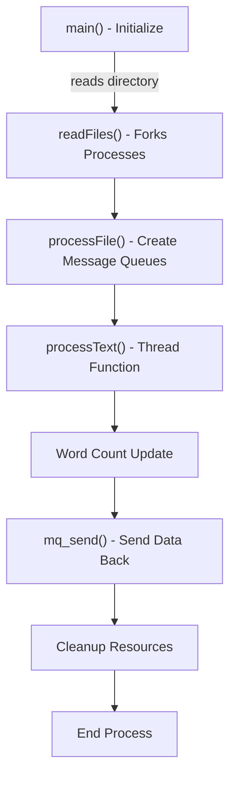
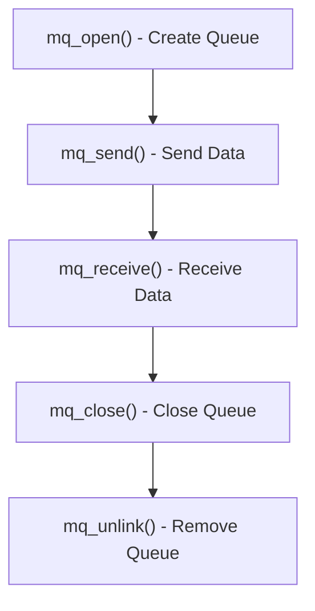
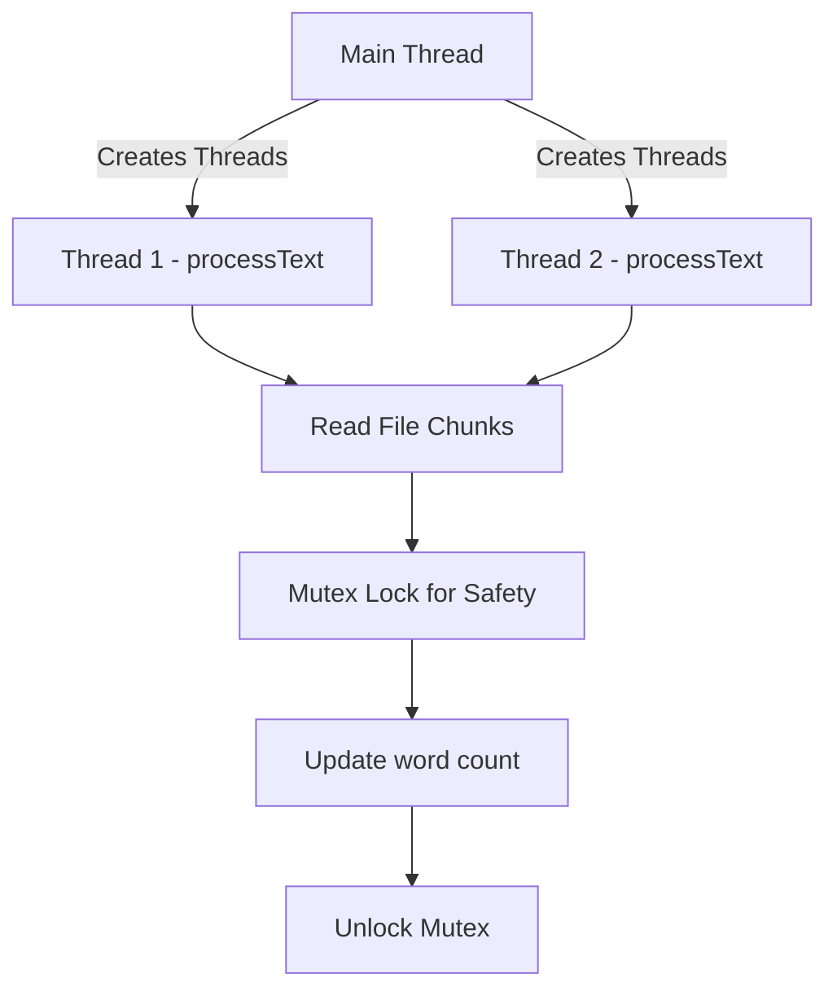
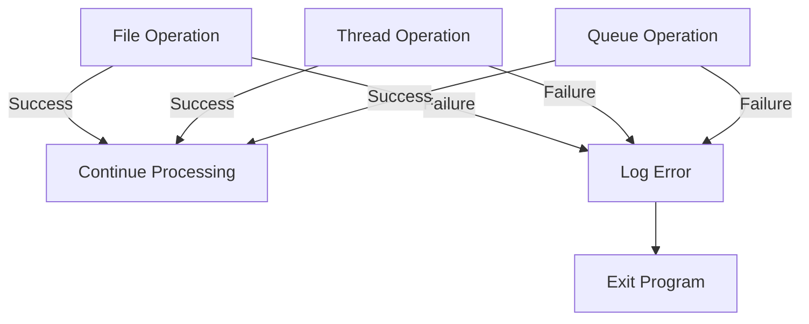
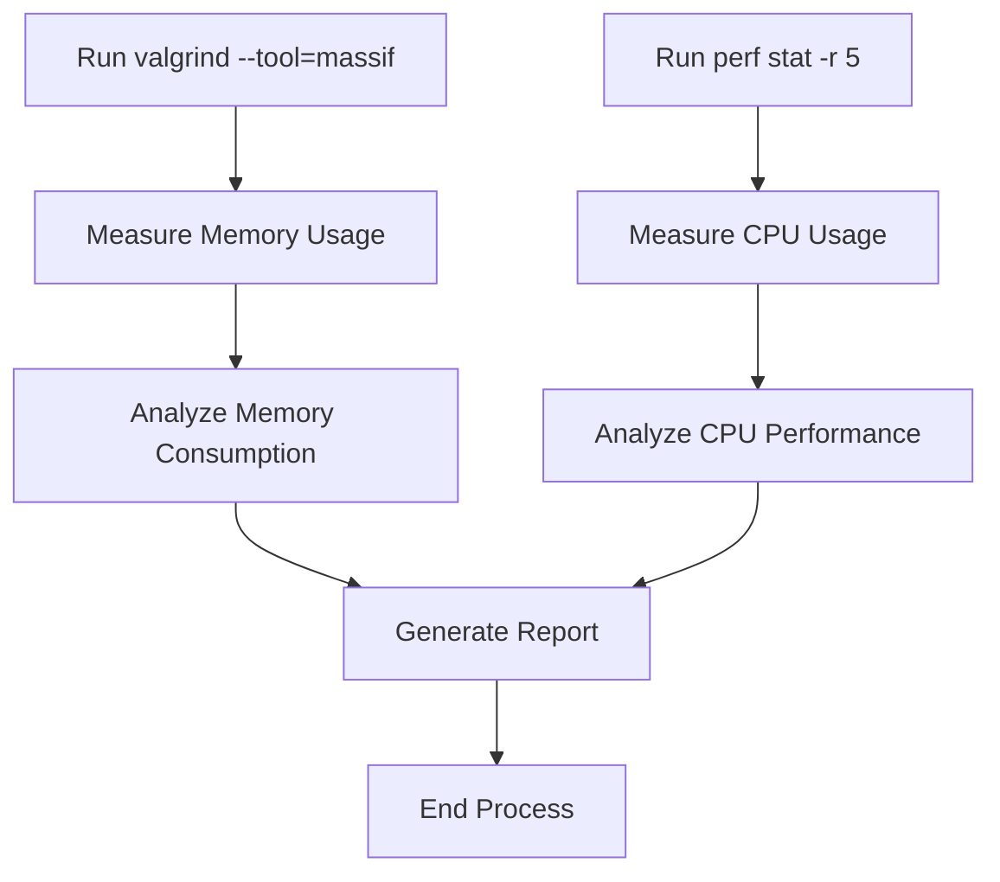
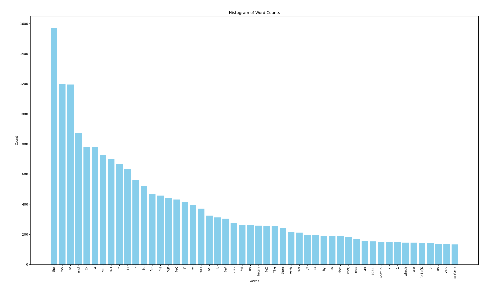

# Table of Content

1. [Code documentation](#code-documentation)
2. [Report](#report)

# Code Documentation
## File Structure

The codebase consists of three main files:

1. **main.c**: The main application logic, including file processing and threading.
2. **helper.c**: Helper functions for directory reading and file operations.
3. **wordmap.c**: Functions for managing a hashmap of words and their counts.

## Detailed Breakdown

### main.c
  
- **Definitions**:
  - `MAX_THREADS`: Maximum number of threads to be used based on compilation flags.
  - `MAX_BYTES_PER_READ`: Maximum bytes to read in a single operation.

- **Data Structures**:
  - `struct ThreadArgs`: Holds arguments for the thread function, including a pointer to the word map, file path, message queue attributes, queue name, and a termination flag.

- **Functions**:
  - `void *processText(void *args)`: Thread function that processes text by reading words from assigned chunks and updating the word map.
  - `void processFile(char *root, char *fileName)`: Creates threads for processing a file, manages message queues, and sends word counts back to the main process.
  - `void readFiles(struct Directory dir, int offset)`: Forks processes to read files from a directory.
  - `int main(void)`: Main entry point, initializes directory reading, processes files, and collects results.

### helper.c

- **Data Structures**:
  - `struct Directory`: Represents a directory with its root path, an array of file names, and the count of files.
  - `struct chunkSize`: Represents a chunk of data with start and end positions for processing.

- **Functions**:
  - `mqd_t createMqQueue(char *queueName, int flags, const struct mq_attr *attr)`: Creates a message queue.
  - `int getWord(FILE *file, char *output, int maxSize)`: Reads the next word from the file, handling whitespace and CSV escaping.
  - `struct chunkSize getNextChunkPosition(FILE *file, long chunkSize)`: Determines the next chunk of text to read from the file, ensuring word boundaries.
  - `struct Directory readDirectory(char *directory)`: Reads the contents of a directory, populating the `Directory` struct.

### wordmap.c

- **Data Structures**:
  - `struct wordElement`: Represents a word and its count.
  - `struct wordMap`: Holds a hashmap for words and a mutex for thread safety.

- **Functions**:
  - `int compare(const void *a, const void *b, void *data)`: Comparison function for the hashmap.
  - `uint64_t hash(const void *item, uint64_t seed0, uint64_t seed1)`: Hashing function for the hashmap.
  - `struct wordMap *wordmapCreate(void)`: Creates and initializes a word map.
  - `void wordmapAdd(struct wordMap *wm, struct wordElement *word)`: Adds a word to the map or increments its count.
  - `void wordmapIncrement(struct wordMap *wm, char *word)`: Increments the count of a word in the map.
  - `void wordmapOutputCsv(struct wordMap *wm)`: Outputs the word map to CSV format.
  - `void wordmapSendAllElements(struct wordMap *wm, mqd_t queueId)`: Sends all elements from the word map to a message queue.

# Report

## Description
### Problem Definition
The project aims to create a system that efficiently processes multiple large text files to count the frequency of specified words. The main challenges include:

1. **File Handling**: The system must accept a directory containing multiple large text files, requiring efficient file reading and management.
  
2. **Parallel Processing**: Each file should be processed in a separate process using `fork()`, which involves managing inter-process communication (IPC) for data sharing.

3. **Multithreading**: Within each process, multiple threads must be created to read and process portions of the file concurrently, necessitating careful management of resources and synchronization.

### My Approaches

1. **File Handling**: I use glibc's `opendir` and `readdir` functions to get the path of all files inside the `files` directory.

2. **Parallel Processing**: A new process is created for each files inside the `files` directory, each child process is responsible for reading a file while the main process will wait for data using message queue (`mqueue.h`)

3. **Multithreading**: A process will create extra `MAX_THREADS` amount of threads for reading the file, the main thread will seperate the files into chunks and send the chunk location data to a queue via message queue, the child threads will read the file according to the chunk location data recieved from the queue, it add the word count to the `wordmap` utilizing `pthread_mutex` to prevent accidental override.

## Code Structures
### 1. Process Management



**Description:**
- The main function initializes the program and reads the specified directory.
- `readFiles` is called, which forks new processes for each file found in the directory.
- Each process calls `processFile`, which creates message queues and spawns threads to process text.
- The `processText` function handles the logic for reading chunks of text, updating word counts, and managing message queues.
- Finally, data is sent back to the main process, which handles cleanup and resource deallocation.

---

### 2. IPC Mechanism



**Description:**
- Inter-process communication (IPC) is facilitated through POSIX message queues.
- Queues are created using `mq_open`, where messages are sent with `mq_send` and received with `mq_receive`.
- After communication, queues are closed using `mq_close` and removed with `mq_unlink` to clean up resources.

---

### 3. Threading



**Description:**
- The main thread creates multiple threads to handle file processing concurrently.
- Each thread executes the `processText` function, which reads chunks of text from files.
- Word counts are updated in a shared data structure, protected by mutex locks to prevent race conditions.

---

### 4. Error Handling



**Description:**
- The code includes error handling for file operations, thread operations, and queue management.
- On success, the program continues processing; on failure, it logs the error and exits.
- Error messages are generated using `strerror(errno)` to provide clear feedback.

---

### 5. Performance Evaluation



**Description:**
- The process starts by executing `valgrind` with the `massif` tool to measure memory usage, followed by analyzing the results.
- Simultaneously, `perf stat -r 5` is run to measure CPU usage over five iterations, with performance data analyzed.
- Finally, a report is written summarizing both memory and CPU performance metrics.

## Instructions
**Note: because this code only work on linux system, the instruction only apply to linux.**

First clone the repository
```sh
git clone --recursive https://github.com/KhoaNguyen55/count-words.git
```

Go into the folder
```sh
cd count-words
```

Because of the unknown license of the files we were given to count the words of, it is not in this repo so you have to download and extract it.
```sh
# download the archive
wget https://corpus.canterbury.ac.nz/resources/calgary.tar.gz
# extract the files
tar -xf calgary.tar.gz -Cfiles paper1 paper2 progc progl progp trans bib
```

Compiles the programs

```sh
make multithread
make singlethread
```

run it
```sh
cd build
./multithread > output-multi.csv
./singlethread > output-single.csv
```

## Results
### Histogram of top 50 words:



### Performance:
#### Single thread: 
**Memory usage**:
- Process 0: peak cost: "12.8 MiB" heap "8.1 KiB" heap extra "0 B" stacks
- Process 1: peak cost: "1.6 MiB" heap "321 B" heap extra "0 B" stacks
- Process 2: peak cost: "1.6 MiB" heap "321 B" heap extra "0 B" stacks
- Process 3: peak cost: "3.2 MiB" heap "321 B" heap extra "0 B" stacks
- Process 4: peak cost: "3.2 MiB" heap "321 B" heap extra "0 B" stacks
- Process 5: peak cost: "3.2 MiB" heap "321 B" heap extra "0 B" stacks
- Process 6: peak cost: "3.2 MiB" heap "321 B" heap extra "0 B" stacks
- Process 7: peak cost: "1.6 MiB" heap "321 B" heap extra "0 B" stacks

**Cpu Usage**:

|Amount|Event|Variance|Note|
| - |      - |   - |   - |
| 193.80 msec | task-clock | 4.38% | 2.486  CPUs utilized
| 8785   | context-switches | 4.35% | 45.330  K/sec
| 84   | cpu-migrations | 10.44% | 433.434  /sec
| 10873   | page-faults | 0.07% | 56.104  K/sec
| 604805819   | cycles | 2.51% | 3.121  GHz
| 185127331   | stalled-cycles-frontend | 1.45% | 30.61%  frontend cycles idle
| 584177432   | instructions | 0.71% | 0.97 insn per cycle, 0.32 stalled cycles per insn
| 119858176   | branches | 0.76% | 618.460  M/sec
| 6182459   | branch-misses | 0.64% | 5.16%  of all branches

0.07995 +- 0.00226 seconds time elapsed  ( +-  2.82% )


#### Multi threads : 5 threads
**Memory usage**:
- Process 0: peak cost: "12.8 MiB" heap "8.1 KiB" heap extra "0 B" stacks
- Process 1: peak cost: "1.7 MiB" heap "481 B" heap extra "0 B" stacks
- Process 2: peak cost: "1.7 MiB" heap "481 B" heap extra "0 B" stacks
- Process 3: peak cost: "3.3 MiB" heap "481 B" heap extra "0 B" stacks
- Process 4: peak cost: "3.3 MiB" heap "481 B" heap extra "0 B" stacks
- Process 5: peak cost: "3.3 MiB" heap "481 B" heap extra "0 B" stacks
- Process 6: peak cost: "3.3 MiB" heap "481 B" heap extra "0 B" stacks
- Process 7: peak cost: "1.7 MiB" heap "481 B" heap extra "0 B" stacks

**Cpu Usage**:
|Amount|Event|Variance|Note|
| - |      - |   - |   - |
| 289.86 msec | task-clock | 4.60% | 3.501  CPUs utilized |
| 11093   | context-switches | 6.26% | 38.270  K/sec
| 803   | cpu-migrations | 6.24% | 2.770  K/sec
| 11013   | page-faults | 0.09% | 37.994  K/sec
| 959741041 | cycles | 5.76% | 3.311  GHz
| 359238116 | stalled-cycles-frontend | 8.99% | 37.43%  frontend cycles idle
| 782356146 | instructions | 5.12% | 0.82  insn per cycle, 0.46  stalled cycles per insn
| 166391696 | branches | 6.04% | 574.043  M/sec
| 12176492 | branch-misses | 9.97% | 7.32%  of all branches

0.07217 +- 0.00440 seconds time elapsed  ( +-  6.09% )

### Discussion of result
#### Single-threaded

- **Memory Usage**: 
  - The peak memory usage across processes was relatively low, with the highest at **12.8 MiB** for the main process and less for others (as low as **1.6 MiB**).
  - Memory usage appears to be efficient, indicating that the application does not require a large heap.

- **CPU Usage**:
  - The task clock recorded **193.80 msec** with **2.486 CPUs utilized**, indicating moderate CPU usage for the single thread.
  - There were **8785 context switches**, showing some degree of multitasking overhead, likely from system processes.
  - A significant portion of the CPU cycles were stalled, with **30.61%** of the frontend cycles being idle, which is most likely the result of IO operations.

- **Execution Time**: The elapsed time was around **0.07995 seconds**, with a variance of **±2.82%**.

#### Multi-threaded Approach (5 threads)

- **Memory Usage**:
  - The peak memory usage for the main process remained the same at **12.8 MiB**, but other threads used slightly more, with peaks around **1.7 MiB** to **3.3 MiB**.
  - Each additional thread introduced a small increase in memory consumption, particularly with an increase in the heap extra usage.

- **CPU Usage**:
  - The task clock increased to **289.86 msec**, this resulted in a higher utilization of **3.501 CPUs**, indicating better use of available resources across multiple threads.
  - Context switches rose to **11093**, reflecting the complexity introduced by multi-threading, with the potential for increased overhead.
  - The percentage of idle frontend cycles increased slightly to **37.43%**.

- **Execution Time**: The elapsed time was approximately **0.07217 seconds**, showing improved performance with a variance of **±6.09%**.

#### Key Differences

1. **Memory Usage**:
   - Single-threaded usage is generally lower and more predictable, while multi-threaded increases the overall footprint due to the overhead of managing multiple threads.

2. **CPU Utilization**:
   - The multi-threaded approach, slightly decrease execution time, and with a increasing in **task-clocks** showing the CPU are utilized more. 

3. **Execution Time**:
   - The multi-threaded version demonstrated a faster execution time despite higher overhead, suggesting that for larger datasets or more complex operations, parallelism can yield better overall performance.

## Discussion of Findings

### Findings

1. **Improved Efficiency with Multi-threading**: The multi-threaded approach exhibited a reduction in execution time from **0.07995 seconds** to **0.07217 seconds**. Indicating that utilizing multiple threads can lead to performance gains, particularly as the size of input data scales.

2. **CPU Utilization**: The multi-threaded implementation achieved better CPU utilization, reaching **3.501 CPUs**, compared to the single-threaded **2.486 CPUs**. This suggests that the system effectively leverages available resources, allowing concurrent processing of file chunks which is crucial in large-scale applications.

3. **Memory Management**: While memory usage increased with multi-threading, the overall footprint remained manageable. The primary process retained a constant peak memory usage of **12.8 MiB**, while individual threads saw slight increases. This indicates that the memory overhead of managing threads was offset by performance benefits.

### Limitations

1. **Increased Context Switching**: The rise in context switches from **8785** in the single-threaded model to **11093** in the multi-threaded version indicates increased overhead associated with thread management. Excessive context switching can lead to performance degradation, particularly in systems with limited resources.

2. **Idle CPU Cycles**: The percentage of stalled cycles increased in the multi-threaded approach, with **37.43%** of frontend cycles idle. This points to potential inefficiencies in how threads are scheduled or how they interact with IO operations, particularly if some threads are waiting for data while others are active.

3. **Thread Management Complexity**: As the number of threads increases, so does the complexity of managing them. Issues such as race conditions, deadlocks, and the need for effective synchronization can complicate implementation and maintenance. This complexity can also introduce bugs that are challenging to diagnose and fix.

### Suggestions for Improvement
1. **Error Handling**:
    - Implement a more consistent and robust error handling strategy. Instead of exiting on errors, consider returning error codes or using error logging mechanisms. This allows for more graceful degradation.

1. **Memory Management**:
    - Ensure all dynamically allocated memory is appropriately freed to prevent memory leaks. Smart pointers or similar techniques to manage ownership.

1. **Performance Considerations**:
    - Evaluate the performance of I/O operations, especially in high-load scenarios. Implement buffering or batching techniques if necessary to optimize file reading and message queue operations.

1. **Testing and Validation**:
   - Implement a comprehensive testing strategy, including unit tests and integration tests, to ensure functionality and catch regressions.

1. **Platform Independence**:
   - Abstracting platform-specific code (like direct system calls or file paths) into a platform-agnostic interface can improve portability.
